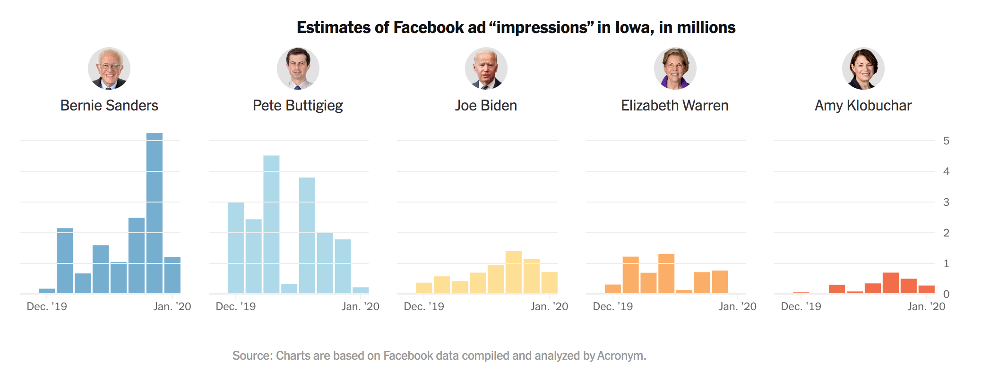
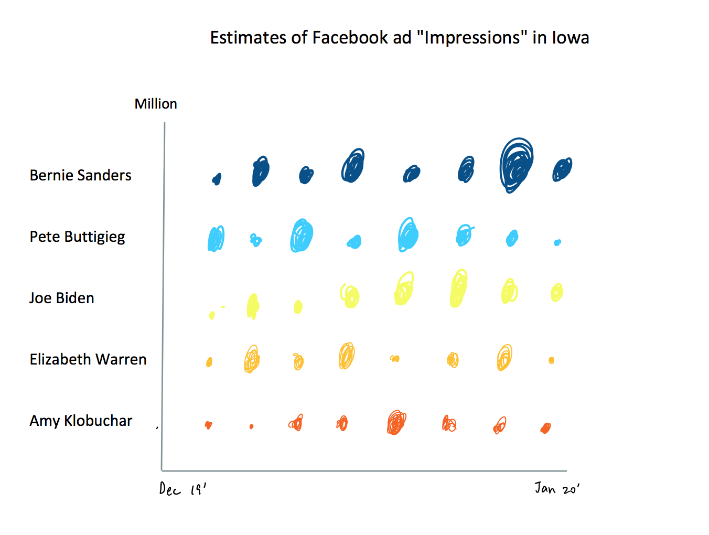
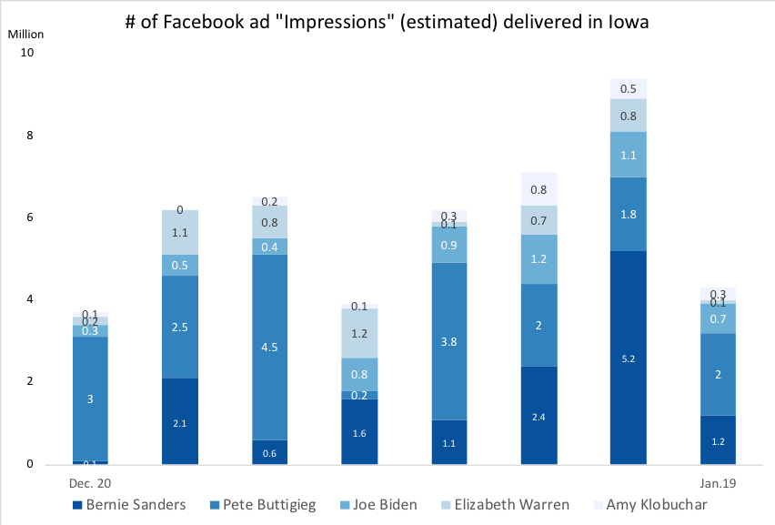

# Assignment Three & Four

## Linke and screenshot of the original visualization
https://www.nytimes.com/interactive/2020/01/29/us/politics/iowa-facebook-political-ads.html

## Explanation on processes
I intend to demonstrate the number of estimates, the comparison among five candidates, and trends over time.
The size of the dot shows the number of estimates of each candidate. The bigger the circle is, the more estimates that the candidate has.
Y-axis represents different candidates. X-axis represents date.
The color is used to distinguish various candidates. 

## Wireframe

## Feedback from intervieweees
### Interviews
- Can you tell me what you think this is?
Interviewee One:
•	This chart shows the number of times these people appear on the Facebook ads “Impression”
Interviewee Two:
•	The estimation of Facebook ads “Impressions” made by those five people over time.
•	The dot size represents the number of estimations made by each person.

- Can you describe to me what this is telling you?
Interviewee One:
•	It’s hard to tell… Maybe Bernie Sanders is more popular than Amy Klobuchar?
•	It looks like the popularity of these people is stable over time.
Interviewee Two
•	It’s hard to tell the trends over time.
•	It looks like Ber Sanders has the highest vitality

- Is there anything you find surprising or confusing?
Interviewee One:
•	The unit on the y-axis is million. However, there are also names on the y-axis
•	It’s hard to tell what the size of dots means. The bigger the better?
•	What does those color stands for?
•	It’s hard to tell the pattern from those dots.
•	What is X-axis. Time? 
Interviewee Two
•	The title is confusing, especially the words “In Iowa”
•	What is the relationship between names and dot size? Does it mean that different people have different estimation numbers?
•	It’s confusing for people who do not have the background of Democrats 
•	Why those numbers can change over such a short period (one month)?

- Who do you think is the intended audience for this?
Interviewee One:
•	Ads owners, like Facebook
Interviewee Two:
•	For people who wants to develop new business using Facebook ads “Impressions”. Those people may want to evaluate whether their investment in this media is reasonable

- Is there anything you would change or do differently?
Interviewee One:
•	Add data label to explain what those color mean
•	Y-axis should only have numbers. No name should appear near the y-axis.
•	Be clearer about the meaning of dot sizes. Make sure the audience understand that the size stands for the total number of impressions
•	Remove 1,2,3,4,5 on y-axis.
Interviewee Two (After explaining what this chart means)
•	Show absolute numbers on the chart.
•	Use a stacked bar chart, which can compare the total number among various candidates. Stacked bar charts can also show trends over time.
•	Since data are discrete instead of being continuous, a bar chart is better than a line chart.

### Reflections
To my surprise, both of the interviewees had trouble understanding this chart. Below are some key reflections and solutions:
Title. The title of current visualization is confusing, especially for those who have little background knowledge of Democrats elections. I will modify the title to better reflect the meaning of this chart.
Chart type. After consideration, I decided to change back to a stacked bar chart. My original design is original, but it failed to be perceptible and intuitive. As mentioned in one of our reading materials, bar charts, line charts and pie charts are the most efficient ways of visualizing. Since these numbers are captured under discrete time, a bar chart makes more sense.
Data number. Detailed numbers should be demonstrated in the chart.
Data Label. Data labels are attached to illustrate the meaning of each stack.
One of the key learning from these feedbacks: The most important purpose of a chart is conveying key ideas to its audience.

## Final Data Visualization

