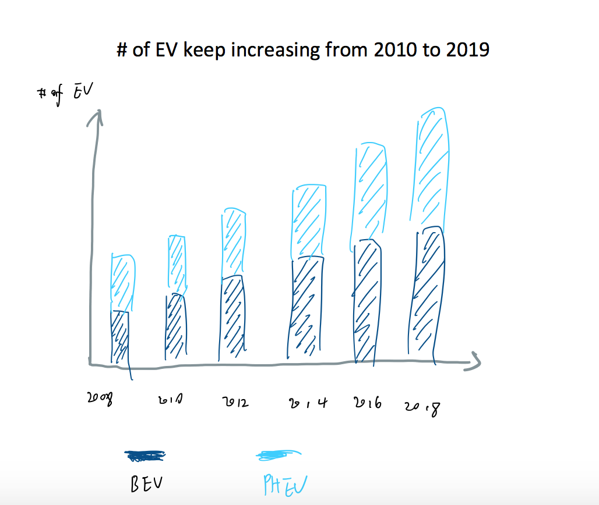
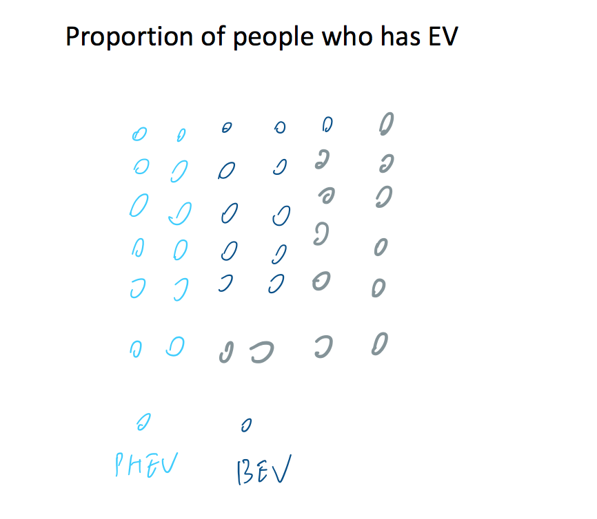
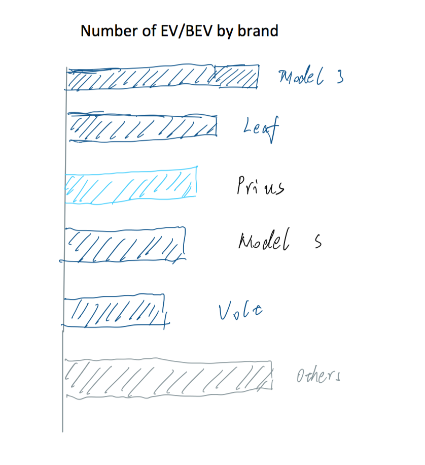
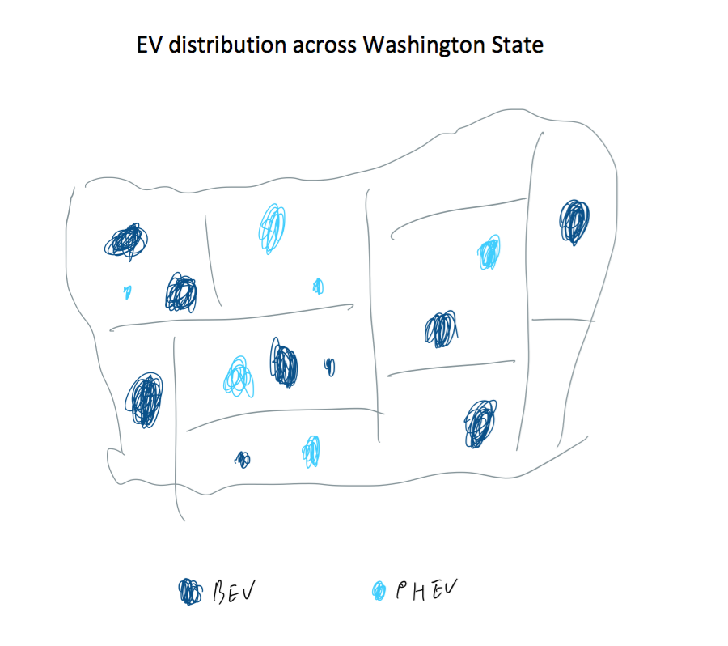
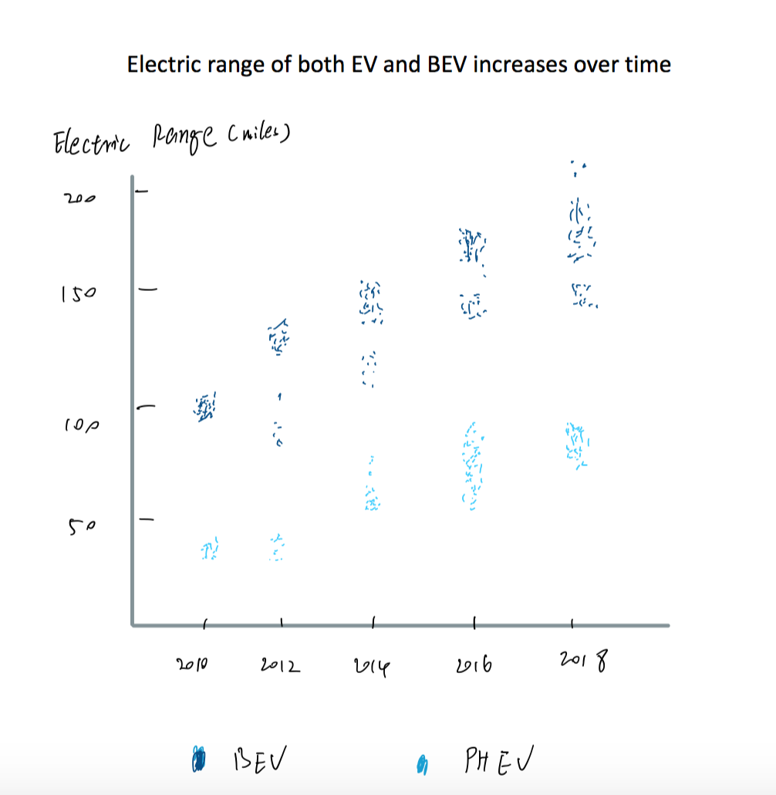
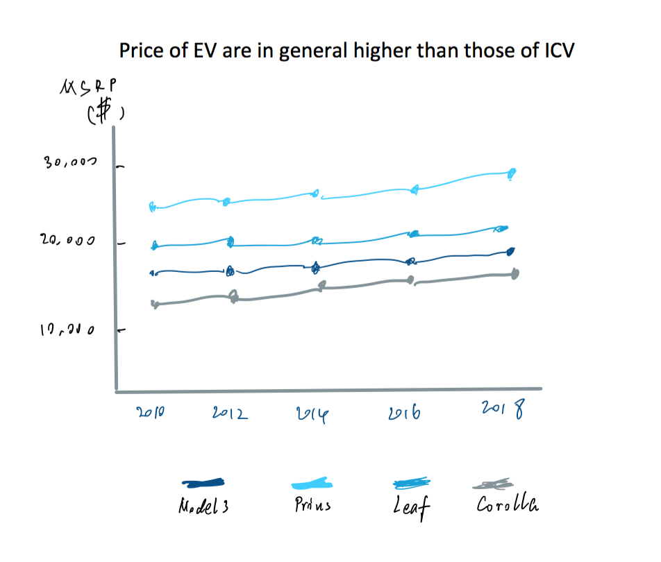

# Topic: Whether people should purchase EV based on the current market situation

## 1. Story Outline
### Introduction of EV
* Pictures of EV. Tesla, BMW, Nissan Leaf, etc...
* Page break

### We will look into the EV statistics in Washington State to facilitate your decisions
* Historic statistics: increase from 2002 to 2020
(Use total EV population in Washington)

* Current percentage of people who has EV(s)
(Use EV population percentage in Washington)

* Top brands and makes
(Use statistics of make/model in the dataset)

* Geo distribution of vehicles in Washington
(Use zip code of those registered vehicles to show EV location distributions)

### Discussion about top concerns while purchasing a BEV
* People usually have Range anxiety
(Existing range distribution)

* They have a concern about vehicle price
(list price and compared it with the average price of ICV)

### Call for action
* Call: Buy EV / not to buy EV (Based on the result of data analysis)

## 2. Data Set
Link for data: https://catalog.data.gov/dataset/electric-vehicle-population-data

This data includes vehicle registration information in Washington DC state. Most of the data is in the past decade.

This dataset contains the following information of a registered vehicle:

County, City, State, ZIP Code, Model, Year, Make, Model, Electric Vehicle Type, Electric Range, Base MSRP, Legislative District, and Vehicle Location

Of all the information above:
* Total number of vehicles will be used for "Historic statistics: increase from 2002 to 2020"
* Make and model data will be used for "Top brands and makes" statistics"
* City, State, Zip Code, and location data will be used for "Geo distribution of vehicles in Washington"
* Electric Range will be used for topics about "Range Anxiety"
* Base MSRP data will be used for topics about "People's concern about vehicle price"

## 3. Platform and Medium
* I will use Shorthand to draw the storyboard.
* I will use RAWGraph for quick visualization. RAWGraph is a good way to do some quick demo of fancy visualizations. Tableau is another visualization tool, especially for some fantastic features like geo-distribution.
* I will also use ColorBrewer to design the color of these visualizations.
* For sketches, I think I will just use Ipad since its flexible and there are plenty of choices of color.
